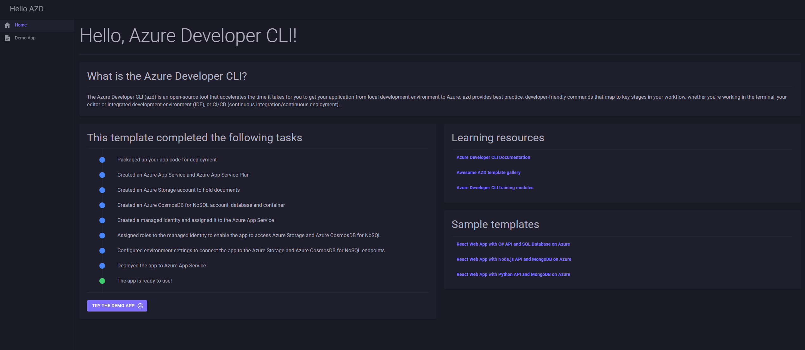

# Hello, Azure Developer CLI (azd)

This template provides an introductory demo template for the [Azure Developer CLI](https://learn.microsoft.com/en-us/azure/developer/azure-developer-cli/overview) (azd). Run the template to provision and deploy resources to Azure and experiment with a working sample app.

Visit the [Azure Developer CLI templates overview](https://learn.microsoft.com/en-us/azure/developer/azure-developer-cli/azd-templates?tabs=csharp) page for more information about templates. The following assets are included in the `hello-azd` template:

- A small sample app to demonstrate deployment and connections to services provisioned by `azd`.
- Infrastructure-as-code (IaC) Bicep files under the `infra` folder that demonstrate how to provision resources and setup resource tagging for azd.
- A [dev container](https://containers.dev) configuration file under the `.devcontainer` directory that installs infrastructure tooling by default. This can be readily used to create cloud-hosted developer environments such as [GitHub Codespaces](https://aka.ms/codespaces).
- Continuous deployment workflows for CI providers such as GitHub Actions under the `.github` directory, and Azure Pipelines under the `.azdo` directory that work for most use-cases.

## Get started

Complete the following steps to run the template and provision resources on Azure:

1. [Install the Azure Developer CLI](https://learn.microsoft.com/en-us/azure/developer/azure-developer-cli/install-azd) on your device.

1. In the command line tool of your choice, run the [`azd init`](https://learn.microsoft.com/en-us/azure/developer/azure-developer-cli/reference#azd-init) command to clone and initialize this template repo.

    ```bash
    azd init -t hello-azd
    ```

1. Package, provision and deploy the app using a single command by running [`azd up`](https://learn.microsoft.com/en-us/azure/developer/azure-developer-cli/reference#azd-up).

The template provisions and deploys the required Azure resources for the app to run, which may take several minutes. When the process completes, your browser should open to the following page:



The template completed the following tasks for you:

- Packaged up your app code for deployment.
- Created an Azure App Service and Azure App Service Plan.
- Created an Azure Storage account to hold documents.
- Created an Azure CosmosDB for NoSQL account, database and container.
- Created a managed identity and assigned it to the Azure App Service.
- Assigned roles to the managed identity to enable the app to access Azure Storage and Azure CosmosDB for NoSQL.
- Configured environment settings to connect the app to the Azure Storage and Azure CosmosDB for NoSQL endpoints.
- Deployed the app to Azure App Service.

The app is now ready to use!

## Additional resources

Visit the following resources for more information about working with the Azure Developer CLI and templates:

- [Azure Developer CLI documentation](https://learn.microsoft.com/en-us/azure/developer/azure-developer-cli/overview)
- [Awesome AZD template gallery](https://azure.github.io/awesome-azd/?tags=python)
- [Azure Developer CLI training modules](https://learn.microsoft.com/en-us/training/paths/azure-developer-cli/)

## Other sample templates

Explore some other common Azure Developer CLI templates:

- [React Web App with C# API and SQL Database on Azure](https://github.com/azure-samples/todo-csharp-sql)
- [React Web App with Node.js API and MongoDB on Azure](https://github.com/azure-samples/todo-nodejs-mongo)
- [React Web App with Python API and MongoDB on Azure](https://github.com/azure-samples/todo-python-mongo)
